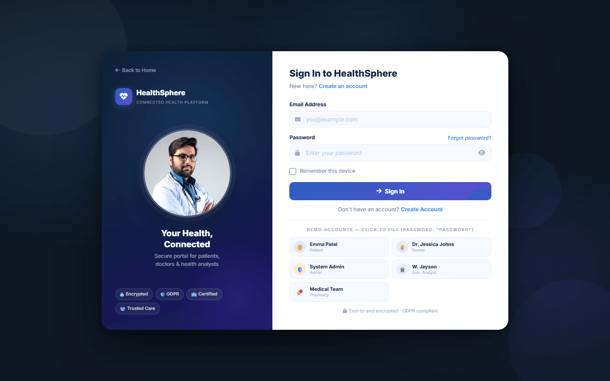
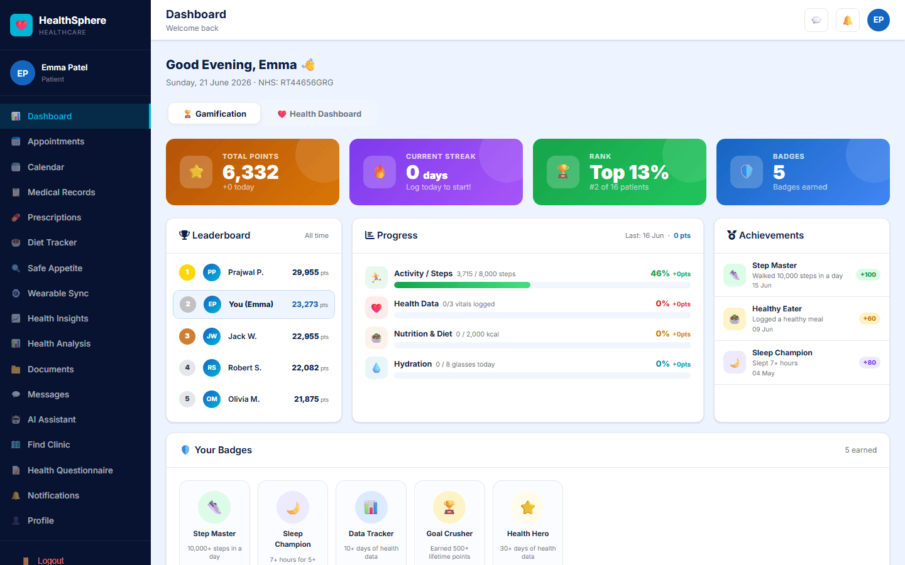
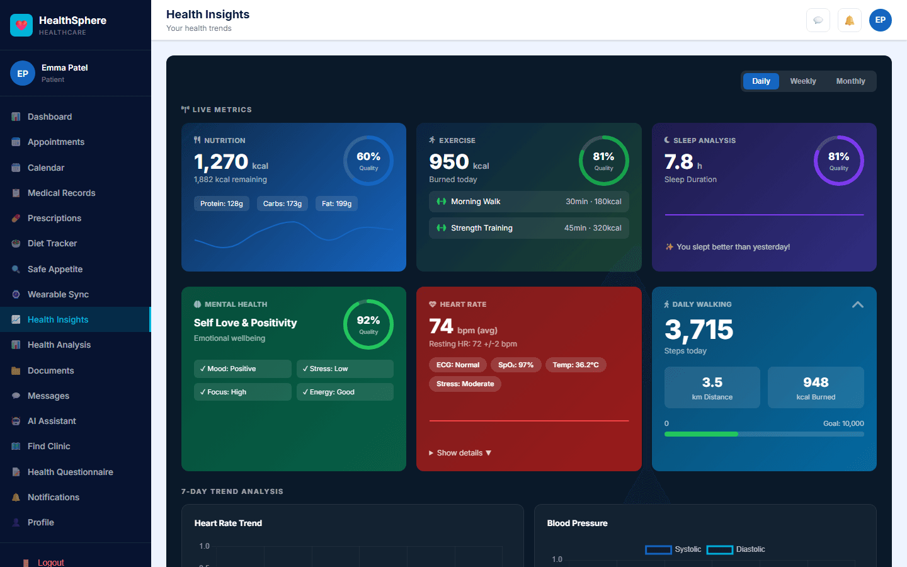
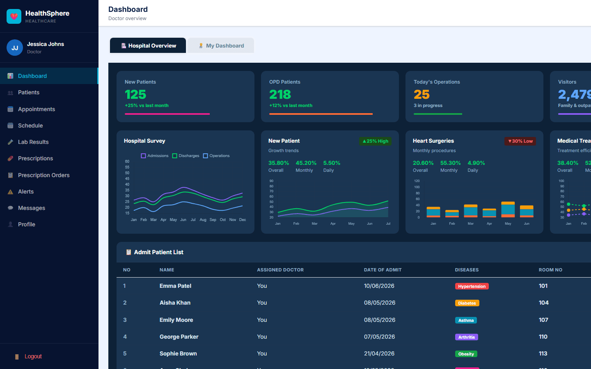
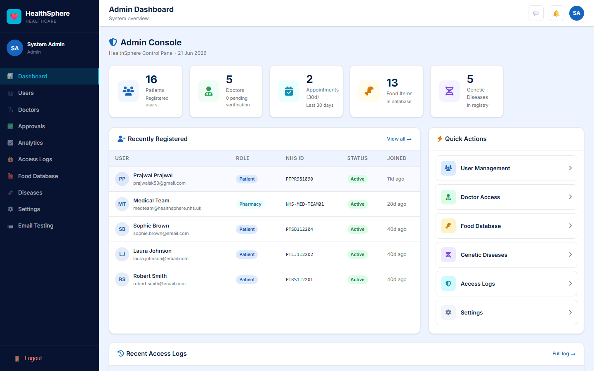
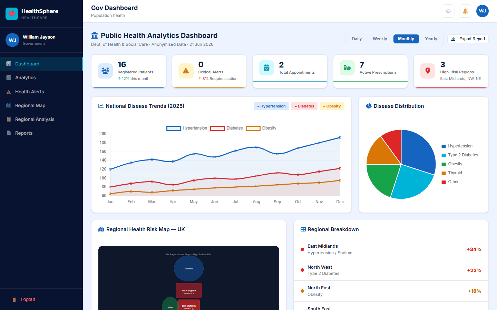

# HealthSphere

**A full-stack healthcare management platform with 4 portals and 37 pages** — patient care, clinical workflows, platform administration, and national population-health analytics, all in one app.

🌐 **Live demo:** https://health-sphere-react.vercel.app



## What it does

HealthSphere is a complete healthcare platform spanning four distinct user roles, each with its own purpose-built dashboard:

- **Patients** book appointments, track diet/exercise/vitals, scan food for allergens, sync wearable data, chat with their doctor in real time, and get AI-powered health insights.
- **Doctors** manage their patient list, review lab results and prescriptions, run their weekly schedule, and respond to health alerts.
- **Admins** verify doctor credentials (HCPC), manage users and approvals, maintain the food/disease databases, and audit access logs.
- **Government analysts** view anonymised, population-level health trends, regional risk maps, and policy reports across England & Wales.

## Screenshots

| Patient dashboard (gamified) | Patient health insights |
|---|---|
|  |  |

| Doctor dashboard | Admin console |
|---|---|
|  |  |

| Government population-health analytics |
|---|
|  |

## Tech Stack

**Frontend** — React 19 · Vite · React Router v6 · Chart.js · FullCalendar · Leaflet (regional heatmaps + hospital maps) · Stripe.js · Socket.IO Client

**Backend** — Node.js · Express · Prisma ORM · PostgreSQL (32 models) · JWT auth · Socket.IO · Stripe

**Integrations** — Google Gemini (AI health assistant + insights) · Spoonacular (food/allergen lookup, with local DB fallback) · Nodemailer (transactional email) · Stripe (payments)

**Deployment** — Frontend on Vercel, backend on Render, database on Neon (serverless Postgres) — both redeploy automatically on push to `master`.

## Architecture

```
                        REACT SPA (Vercel)
        Patient · Doctor · Admin · Government portals
        Axios (REST)              Socket.IO (WebSocket)
                  │                       │
                        EXPRESS API (Render)
        JWT auth → role middleware → controllers → Prisma
        Modules: appointments, records, prescriptions, diet,
                 messaging, payments (Stripe), alerts, analytics
                  │                       │
              PostgreSQL (Neon)      External APIs
              32 Prisma models       Gemini · Spoonacular · Stripe
```

## Getting Started

### 1. Database
```bash
cd backend
cp .env.example .env
# set DATABASE_URL to your PostgreSQL connection string
npx prisma migrate deploy
node seed.js   # optional demo data
```

### 2. Backend
```bash
cd backend
npm install
npm run dev          # http://localhost:5002
```

### 3. Frontend
```bash
cd frontend
npm install
npm run dev           # http://localhost:5175
```

### Demo accounts (password: `password`)
| Role | Email |
|------|-------|
| Patient | emma.patel007@gmail.com |
| Doctor | doctor@healthsphere.com |
| Admin | admin@healthsphere.com |
| Government | govt@healthsphere.com |

## Portals

### Patient Portal (14 pages)
Dashboard with health score ring · appointment booking · medical records (labs, prescriptions, allergies, vaccinations) · diet tracker with macro + water logging · Safe Appetite allergen scanner · 7-day health insight trends · wearable sync (Google Fit via Drive Takeout) · real-time doctor messaging · AI health assistant (Gemini) · NHS hospital map · documents, notifications, profile.

### Doctor Portal (9 pages)
Dashboard with today's patients + critical alerts · patient management with drill-down · appointment status management · lab results + prescriptions · weekly schedule · health alerts · real-time messaging.

### Admin Portal (8 pages)
Platform statistics · user management (CRUD + status) · doctor HCPC verification · approval queue · analytics charts · access audit logs · food database management · genetic disease registry.

### Government Portal (5 pages)
Anonymised population health dashboard · analytics charts · public health alert system · UK regional risk map · national disease trend analysis.

## Project Structure

```
healthsphere/
├── backend/
│   ├── src/
│   │   ├── config/        # Database config
│   │   ├── controllers/   # Business logic
│   │   ├── middleware/    # JWT auth, role guards
│   │   └── routes/        # API routes
│   ├── prisma/            # Schema (32 models) + migrations
│   └── scripts/           # Legacy PHP → Postgres data importer
└── frontend/
    ├── src/
    │   ├── api/           # Axios client
    │   ├── components/    # Sidebar, Layout, shared UI
    │   ├── context/       # Auth context
    │   └── pages/         # 37 pages across 4 portals
```

## Background

This started as a PHP application and was rebuilt page-by-page as a React + Express platform — `backend/scripts/import-php-dump.js` migrates the original MySQL dump into the new Postgres schema, preserving all historical patient, doctor, and admin data.

## Author

**Prajwal Kateel** — [GitHub](https://github.com/prajwalkateel0)
